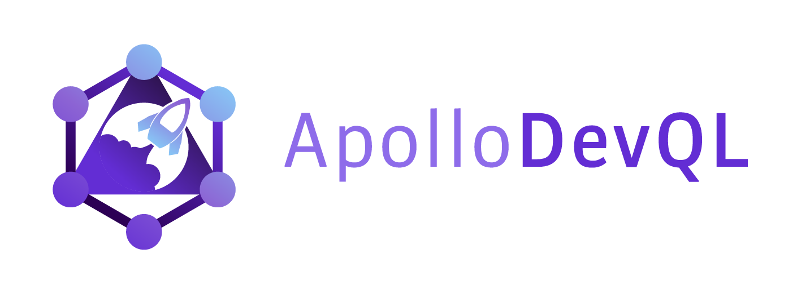
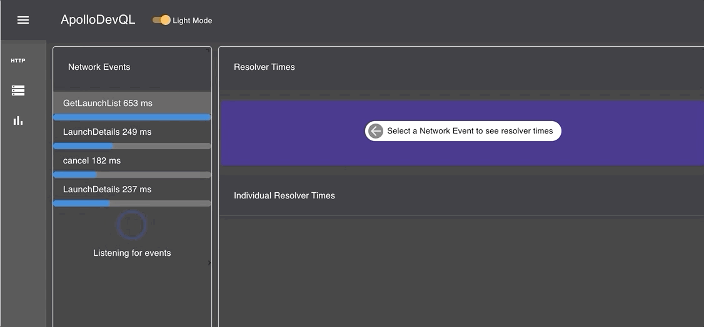

  

<h1 align="center">
  Client Debugger for Apollo GraphQL
</h1>

<b><a href="https://apollodevql.com/">ApolloDevQL</a></b> is a debugging and querying tool for GraphQL developers. It finds the Apollo instance of your application and allows the developer to test queries, debug cache and measure query/resolver performance.

Currently, ApolloDevQL 1.0 beta supports Apollo Client's 2.0 and 3.0 and transport mechansism to your GraphQL endpoint needs to be a POST request.

After installing ApolloDevQL in your Chrome browser, you can test its functionalities with the following demo repositories:

- [Apollo's Fullstack Tutorial](https://github.com/apollographql/fullstack-tutorial)
- [TBD](http://reactime-demo2.us-east-1.elasticbeanstalk.com)

## <b>Installation</b>

To get started, install the ApolloDevQL [extension](https://chrome.google.com/webstore/detail/kdbhdgkakklkjhcfiighgonefimkpaeh) from Chrome Web Store.

## <b>How to Use</b>

After installing the Chrome extension, just open up your project in the browser.

Then open up your Chrome DevTools and navigate to the ApolloDevQL panel.

## <b>Features</b>

### GraphiQL

- Run independent queries on the graphQL endpoint of the website or a secondary website using the alternative url. Inspect your queries and build queries using the explorer feature in the GraphiQL Tab.

### Events & Cache

- View all of the events, queries and mutations created in your App
- View the cache and details at the time of the event
- Events are displayed on a timeline allowing you to track changes at each point of interaction with you app

### Performance

- Displays the performance times fo all resolvers that have been run
- Visually displays the performance data so you can quickly interpret the data
- Performance data is sorted by time taken to track any performance issues

## <b>Authors</b>

- **Matt Digel** - [@mdigel](https://github.com/mdigel)
- **Lanre Makinde** - [@lanre-mark](https://github.com/lanre-mark)
- **Rob Wise** - [@robcodehub](https://github.com/robcodehub)
- **Steve Dang** - [@sdang-git](https://github.com/sdang-git)

## <b>License </b>

This project is licensed under the MIT License - see the [LICENSE](LICENSE) file for details
